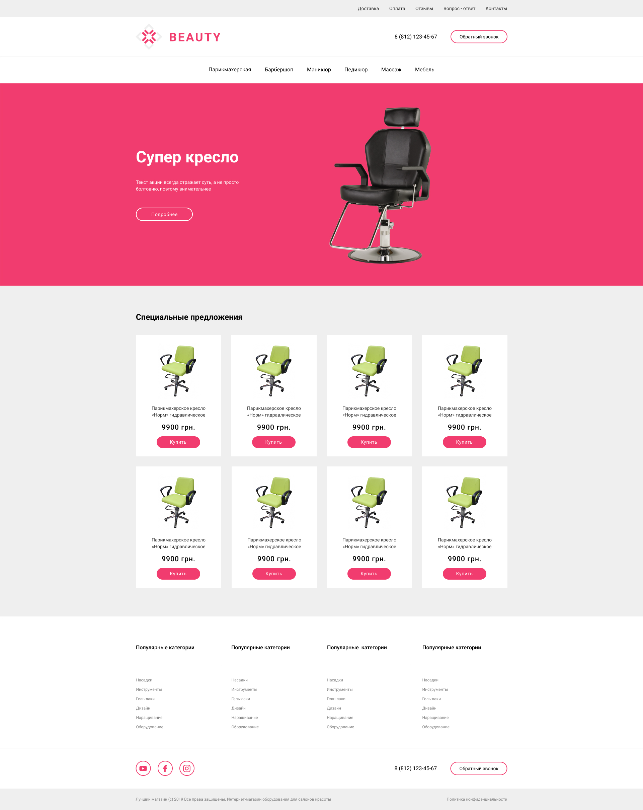

# Виконати верстку макету

# Технічне завдання

# Макет из ДЗ-7 сделать резиновым

# Ширина макета должна быть в диапазоне 991px – 1200px
# Весь макет не липнет к краям и содержит общие отступы
# Первое меню всегда прижато вправо
# Логотип слева, а телефон и «обратный звонок» справа. Расстояние между телефоном и «обратный звонок» - статичное
# Блок с товарами. Отступы между товарами указаны в px статично. Резиновой должна быть сама карточка товара. (весь контент карточки по центру независимо от ширина карточки)
# Количество текста в заголовке товара может быть любым (одна строка, две, три …) При этом сетка не должна ломаться. (высота белого прямоугольника будет разная она зависит от контента)
# Верхняя часть футера сделана по такому же принципу, как и сетка с товарами
# Нижняя часть футера. Иконки соц сетей слева, а телефон и «обратный звонок» справа. Расстояние между телефоном и «обратный звонок» - статичное
# Иконки социальных сетей при наведении меняют цвет на черный
# Вся графика ужата
# На ширине 1140px верстка полностью соответствует макету, допустимые расхождения 5px

